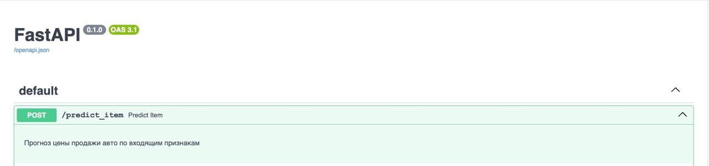
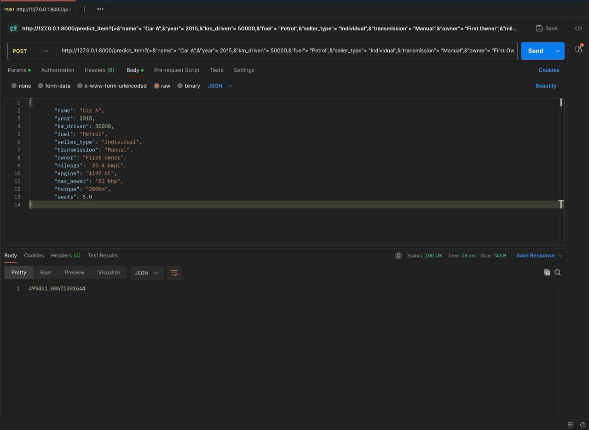
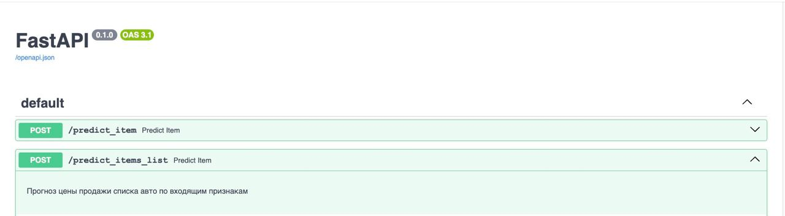
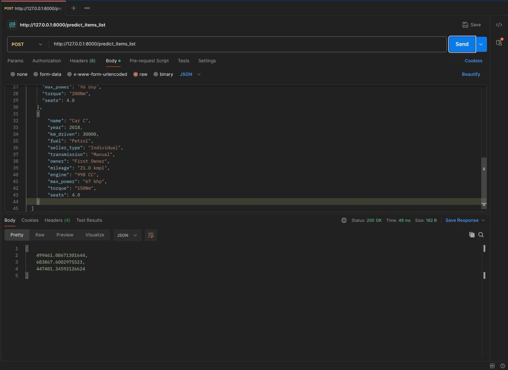
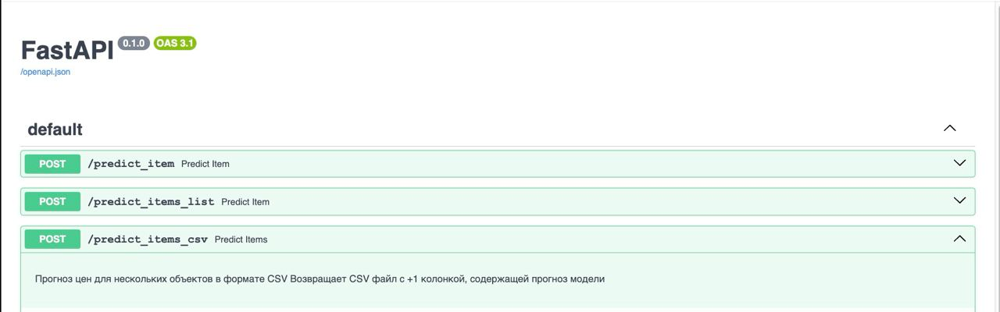

## HW1
Решали задачу прогнозирования цены продажи авто с пробегом по входящим значениям признаков.

### DS

#### Что было сделано
1. Провели базовый EDA
2. Построили инфо дашборд по данным
3. Провели первичную обработку признаков
    - Убрали ненужные (сложные в обработке) признаки
    - Вычленили числовые значения из некоторых строковых полей
    - Заполнили пропуски
4. Убрали полные дубликаты (по признакам)
5. Построили графики попарных распределений и посмотрели на матрицу корреляций
    - Попытались угадать важные признаки (и удалось +-) 
6. Провели доп. анализ в отдельных срезах
    - зависимость кол-ва купленных авто в зависимости от года в разрезе трансмиссий
    - зависимость средней мощности авто в зависимости от года покупки
    - зависимость среднего расхода топлива в зависимости от вида топлива
    - зависимость средней цены продажи авто в зависимости от года покупки в разрезе кол-ва владельцев
7. Построили модель на числовых признаках (обычную линейную регрессию)
     - Попытались объяснить, почему R^2 на трейне и тесте совпадают, при этом MSE сильно отличаются
9. Масштабировали числовые признаки c помощью `StandardScaler` и обучили заново линейную регрессию
10. Обучили линейную регрессию с `Lasso` регуляризацией с дефолтными параметрами и посчитали качество на кросс-валидации
    - Попытались объяснить, почему ни один вес не занулился
11. Подобрали через `GridSearchCV` оптимальные параметры для `Lasso` модели и посчитали качество на кросс-валидации
12. Подобрали через `GridSearchCV` оптимальные параметры для линейной регрссии с `ElasticNet` регуляризацией и посчитали качество на кросс-валидации
13. Добавили категориальные признаки (и их обработку)
14. Обучили линейную регрессию с `Ridge` регуляризацией с подбором оптимального параметра силы регуляризации и посчитали качество на кросс-валидации
15. Разработали собственную бизнесовую метрику качества модели и оценили качества всех 3 моделей по ней
16. Определили лучшую модель
17. Собрали весь пайплайн обработки для лучшей модели и заново обучили лучшую модель на всем трейне
18. Построили `FastAPI` сервис на основе лучшей модели, который умеет предсказывать цену продажи авто по входящим признакам
    - подробнее про сервис ниже
19. Попытались угадать кота:)

#### Результаты
1. Масштабирование данных не дало прироста к метрикам
2. Регуляризация (ни одна) не дала прироста к метрикам
3. **Добавление обработанных категориальных признаков дало ощутимый прирост в качестве модели**
4. На собственной бизнесовой метрике получили схожий результат: последняя `Ridge` модель на числовых и категориальных признаках перформит лучше предыдущих моделей
    - Однако, качество сильно хуже, чем по дефолтной метрике R^2
5. Построили **работающий** `FastAPI` сервис на основе нашей лучшей модели, который умеет предсказывать цену продажи авто по входящим признакам

#### Наибольший буст в качестве
Наибольший буст в качестве дало включение и обработка категориальных признаков.  
R^2: 0.59 -> 0.65

#### Что можно улучшить
Приседания в сторону улучшения качества модели:
1. Включить в модель первые 2 поля из признака `name`, которые я обработал
2. Обработать `torque`
3. Пофильтровать выбросы
4. Трансформация таргета (логарифмирование, например, отчасти лечит пункт 3)

### FastAPI Service
**Сервис реализован с 3 эндпоинтами:**
1. `/predict_item` - Прогноз цены продажи авто по входящим признакам
    - `json[Item]` -> `float`
2. `/predict_items_list` - Прогноз цен продаж списка авто по входящим признакам
    - `json[List[Item]]` -> `List[float]`
3. `/predict_items_csv` - Прогноз цен для нескольких объектов в формате CSV Возвращает CSV файл с +1 колонкой, содержащей прогноз модели
    - `csv` -> `csv`

### Service Screenshots

| Docs                  | Postman              |
|-----------------------|----------------------|
|  |  |
|  |  |
|  |  |
